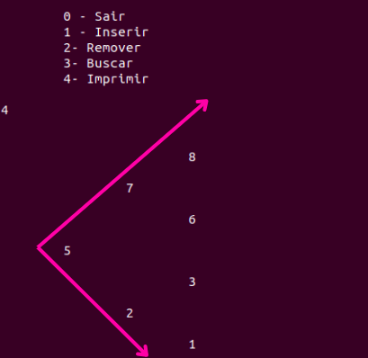

# Árvore Rubro-Negra

Este projeto implementa uma árvore rubro-negra, um tipo de árvore binária balanceada que garante que a profundidade de qualquer folha seja aproximadamente a mesma em toda a árvore. O principal objetivo desta implementação é permitir a inserção, remoção, busca e impressão de elementos de forma balanceada, utilizando as propriedades específicas de uma árvore rubro-negra.

## Descrição

A árvore rubro-negra é uma estrutura de dados auto-balanceada que mantém a altura das árvores logaritmica, o que garante operações eficientes de inserção, remoção e busca, todas com complexidade de tempo O(log n), onde n é o número de nós na árvore.

### Características da Árvore Rubro-Negra:
- Cada nó é vermelho ou negro.
- A raiz é sempre negra.
- As folhas são sempre negras.
- Se um nó é vermelho, então ambos os filhos são negros.
- Qualquer caminho de um nó até suas folhas possui o mesmo número de nós negros.

## Funcionalidades

O código implementa as seguintes operações básicas para manipulação da árvore rubro-negra:

- **Inserir**: Adiciona um novo valor à árvore, mantendo o balanceamento necessário.
- **Remover**: Remove um valor da árvore e reequilibra a estrutura se necessário.
- **Buscar**: Procura por um valor específico na árvore e retorna o nó correspondente.
- **Imprimir**: Exibe a árvore em uma representação visual.

## Como Usar

### Compilação

Para compilar o código, utilize um compilador C (ex: GCC). Execute o seguinte comando no terminal:

```bash
gcc -o rubronegra rubronegra.c
```

### Execução

Após a compilação, execute o programa gerado com:

```bash
./rubronegra
```

### Opções Disponíveis

Quando o programa for executado, o usuário poderá escolher entre as seguintes opções no menu:

1. **Inserir**: Inserir um valor na árvore.
2. **Remover**: Remover um valor da árvore.
3. **Buscar**: Buscar um valor na árvore.
4. **Imprimir**: Imprimir a estrutura da árvore.
0. **Sair**: Finalizar o programa.

### Exemplo de Execução

A árvore é impressa de lado, no exemplo abaixo inserimos respectivamente os valores: 5, 6, 2, 3, 1, 7, 8. A saída está impressa logo abaixo:

<p align="center">
  
</p>


## Estruturas de Dados

O código utiliza as seguintes estruturas para representar a árvore rubro-negra:

- **No**: Estrutura que contém o valor do nó, ponteiros para o nó esquerdo, direito e pai, além de uma variável de cor (Rubro ou Negro).
- **tipoArvore**: Estrutura que contém o ponteiro para a raiz da árvore.

## Funções

Algumas das funções principais implementadas no código incluem:

- `rotacionaEsquerda()`: Realiza uma rotação à esquerda em um nó.
- `rotacionaDireita()`: Realiza uma rotação à direita em um nó.
- `inserir()`: Insere um valor na árvore e reequilibra.
- `remover()`: Remove um valor da árvore e realiza o balanceamento adequado.
- `verifica_balanceamento()`: Verifica o balanceamento após inserção ou remoção.
